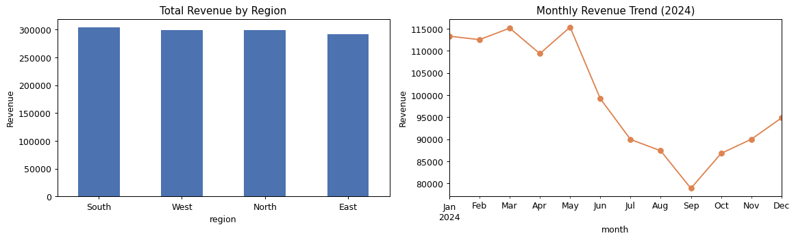

# Sales Data Analysis with pandas & NumPy

An end-to-end exploratory data analysis (EDA) in a Jupyter notebook, taking a messy raw sales dataset through the full analyst workflow: **assess → clean → analyze → visualize.**

*Data is fictional and generated purely for demonstration.*

## What this demonstrates

| Stage | Skills shown |
|-------------|------------------------------------------------------------|
| Assess | `info()`, null counts, duplicate detection, `describe()`, spotting inconsistencies |
| Clean | text standardization, dropping duplicates, group-wise median imputation, IQR outlier capping |
| Analyze | `groupby` aggregation, revenue share, monthly trend, NumPy percentile math |
| Visualize | matplotlib bar + line charts |

## The cleaning story

The raw dataset is intentionally messy — the kind of thing you actually get handed:

- Inconsistent region labels (`north`, `' South '`) → standardized with `.str.strip().str.title()`
- A duplicate row → removed with `drop_duplicates()`
- Missing `revenue` and `units` → filled with the **category median** (not a blunt global mean)
- A revenue outlier → capped using the **IQR method** (`np.percentile`)

Handling each of these deliberately — rather than blindly dropping rows — is what separates a reliable analysis from a fragile one.

## Findings

- Revenue is fairly balanced across the four regions.
- **Fonts** is the largest category by revenue share.
- Monthly revenue follows a mild seasonal pattern across 2024.



## How to run

```bash
pip install pandas numpy matplotlib jupyter
jupyter notebook sales_analysis.ipynb
```

Run all cells top to bottom. `sales_data.csv` is included; the notebook reads it, cleans it, and produces the charts.

## Files

- `sales_analysis.ipynb` — the analysis notebook (renders directly on GitHub)
- `sales_data.csv` — the fictional raw dataset
- `revenue_charts.png` — exported charts

## Tools

Python · pandas · NumPy · matplotlib · Jupyter
